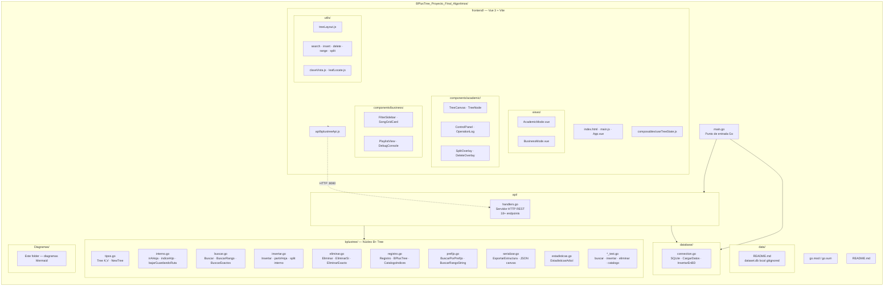
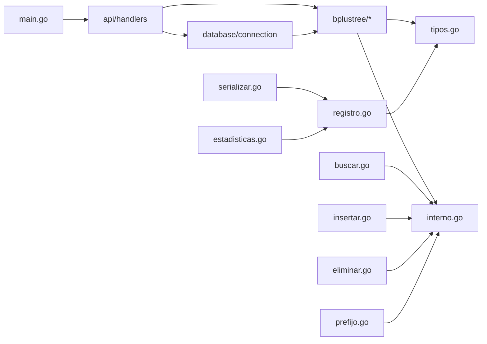

# Estructura del Repositorio

Copia el bloque en [Mermaid Live Editor](https://mermaid.live).

```mermaid
flowchart TB
    subgraph ROOT["BPlusTree_Proyecto_Final_Algoritmos/"]
        direction TB

        MAIN["main.go<br/>Punto de entrada Go"]
        GOMOD["go.mod / go.sum"]
        README["README.md"]

        subgraph API["api/"]
            HANDLERS["handlers.go<br/>Servidor HTTP REST<br/>18+ endpoints"]
        end

        subgraph BPT["bplustree/ — Núcleo B+ Tree"]
            direction TB
            TIPOS["tipos.go<br/>Tree K,V · NewTree"]
            INTERNO["interno.go<br/>irAHoja · indiceHijo · bajarGuardandoRuta"]
            BUSCAR["buscar.go<br/>Buscar · BuscarRango · BuscarExactos"]
            INSERTAR["insertar.go<br/>Insertar · partirHoja · split interno"]
            ELIMINAR["eliminar.go<br/>Eliminar · EliminarSi · EliminarExacto"]
            REGISTRO["registro.go<br/>Registro · BPlusTree · CatalogoIndices"]
            PREFIJO["prefijo.go<br/>BuscarPorPrefijo · BuscarRangoString"]
            SERIAL["serializar.go<br/>ExportarEstructura · JSON canvas"]
            STATS["estadisticas.go<br/>EstadisticasArbol"]
            TESTS["*_test.go<br/>buscar · insertar · eliminar · catalogo"]
        end

        subgraph DB["database/"]
            CONN["connection.go<br/>SQLite · CargarDatos · InsertarEnBD"]
        end

        subgraph DATA["data/"]
            DATAR["README.md<br/>dataset.db local gitignored"]
        end

        subgraph FE["frontend/ — Vue 3 + Vite"]
            direction TB
            ENTRY["index.html · main.js · App.vue"]
            subgraph VIEWS["views/"]
                ACAD["AcademicMode.vue"]
                BIZ["BusinessMode.vue"]
            end
            subgraph COMP_ACAD["components/academic/"]
                CANVAS["TreeCanvas · TreeNode"]
                CTRL["ControlPanel · OperationLog"]
                OVER["SplitOverlay · DeleteOverlay"]
            end
            subgraph COMP_BIZ["components/business/"]
                FILTER["FilterSidebar · SongGridCard"]
                PLAY["PlaylistView · DebugConsole"]
            end
            subgraph UTILS["utils/"]
                LAYOUT["treeLayout.js"]
                ANIM["search · insert · delete · range · split"]
                CLAVE["claveVista.js · leafLocate.js"]
            end
            APIJS["api/bplustreeApi.js"]
            COMPOS["composables/useTreeState.js"]
        end

        subgraph DIAG["Diagramas/"]
            DIAGFILES["Este folder — diagramas Mermaid"]
        end
    end

    MAIN --> API
    MAIN --> DB
    API --> BPT
    API --> DB
    FE --> APIJS
    APIJS -.->|HTTP :8080| HANDLERS
```

## Mapa de dependencias Go

```mermaid
flowchart LR
    main["main.go"] --> api["api/handlers"]
    api --> bpt["bplustree/*"]
    api --> db["database/connection"]
    db --> bpt
    bpt --> tipos["tipos.go"]
    bpt --> interno["interno.go"]
    buscar["buscar.go"] --> interno
    insertar["insertar.go"] --> interno
    eliminar["eliminar.go"] --> interno
    registro["registro.go"] --> tipos
    prefijo["prefijo.go"] --> interno
    serial["serializar.go"] --> registro
    stats["estadisticas.go"] --> registro
```
