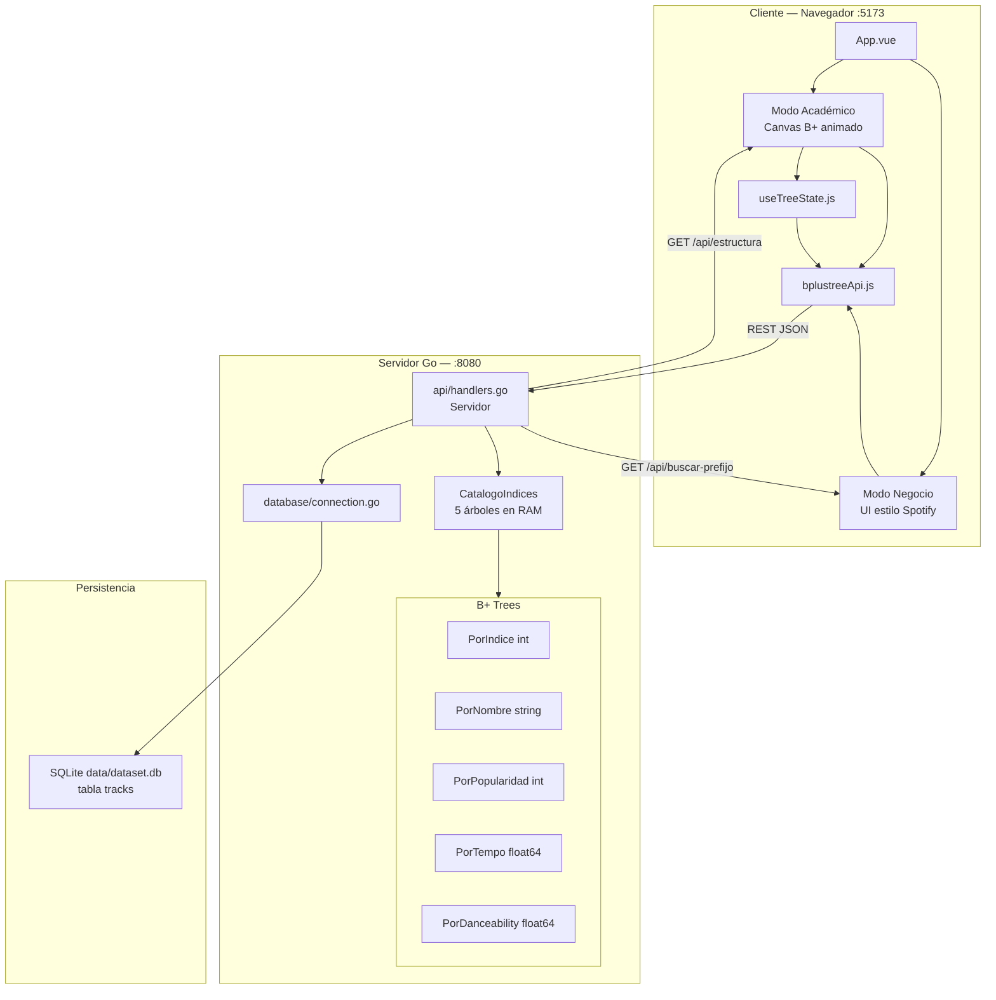
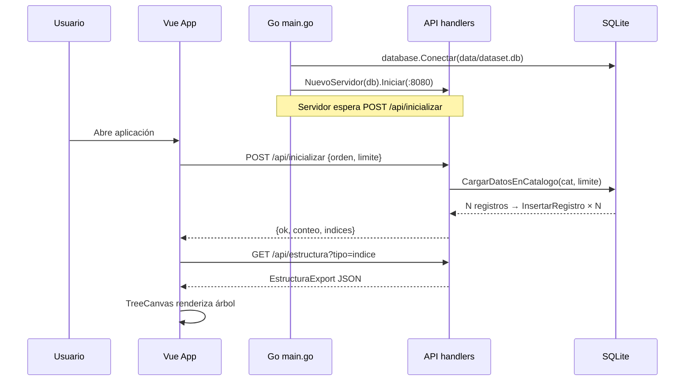

# Arquitectura General del Sistema

```mermaid
flowchart TB
    subgraph CLIENTE["Cliente — Navegador :5173"]
        APP["App.vue"]
        ACAD["Modo Académico<br/>Canvas B+ animado"]
        NEG["Modo Negocio<br/>UI estilo Spotify"]
        APIJS["bplustreeApi.js"]
        STATE["useTreeState.js"]
    end

    subgraph SERVIDOR["Servidor Go — :8080"]
        HAND["api/handlers.go<br/>Servidor"]
        CAT["CatalogoIndices<br/>5 árboles en RAM"]
        subgraph ARBOLES["B+ Trees"]
            I["PorIndice int"]
            N["PorNombre string"]
            P["PorPopularidad int"]
            T["PorTempo float64"]
            D["PorDanceability float64"]
        end
        DBL["database/connection.go"]
    end

    subgraph PERSIST["Persistencia"]
        SQL["SQLite data/dataset.db<br/>tabla tracks"]
    end

    APP --> ACAD
    APP --> NEG
    ACAD --> STATE
    ACAD --> APIJS
    NEG --> APIJS
    STATE --> APIJS

    APIJS -->|REST JSON| HAND
    HAND --> CAT
    CAT --> ARBOLES
    HAND --> DBL
    DBL --> SQL

    HAND -->|GET /api/estructura| ACAD
    HAND -->|GET /api/buscar-prefijo| NEG
```

## Secuencia: arranque del sistema

```mermaid
sequenceDiagram
    participant U as Usuario
    participant V as Vue App
    participant G as Go main.go
    participant A as API handlers
    participant S as SQLite

    G->>S: database.Conectar(data/dataset.db)
    G->>A: NuevoServidor(db).Iniciar(:8080)
    Note over G,A: Servidor espera POST /api/inicializar

    U->>V: Abre aplicación
    V->>A: POST /api/inicializar {orden, limite}
    A->>S: CargarDatosEnCatalogo(cat, limite)
    S-->>A: N registros → InsertarRegistro × N
    A-->>V: {ok, conteo, indices}
    V->>A: GET /api/estructura?tipo=indice
    A-->>V: EstructuraExport JSON
    V->>V: TreeCanvas renderiza árbol
```
