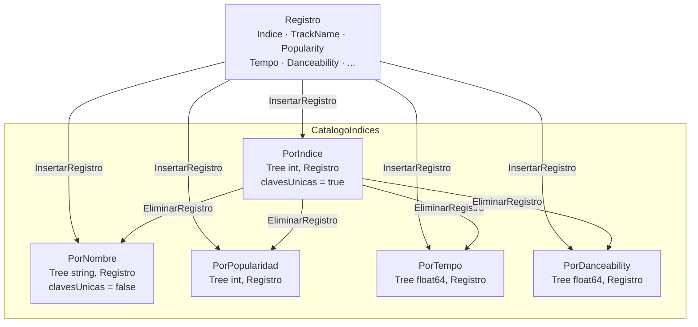
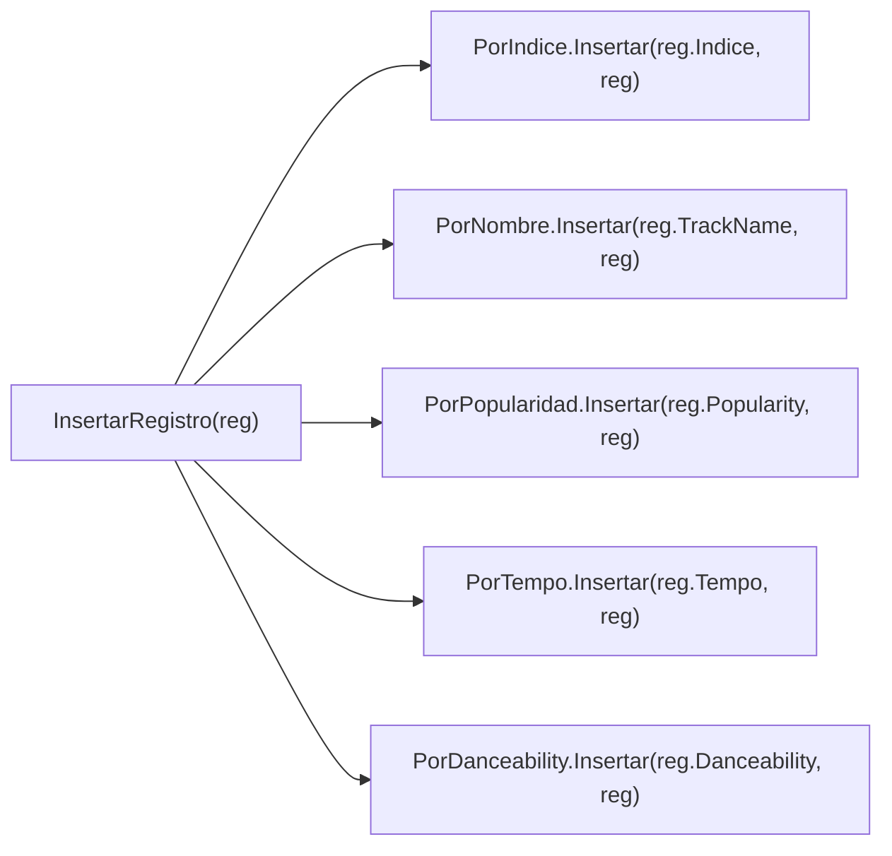
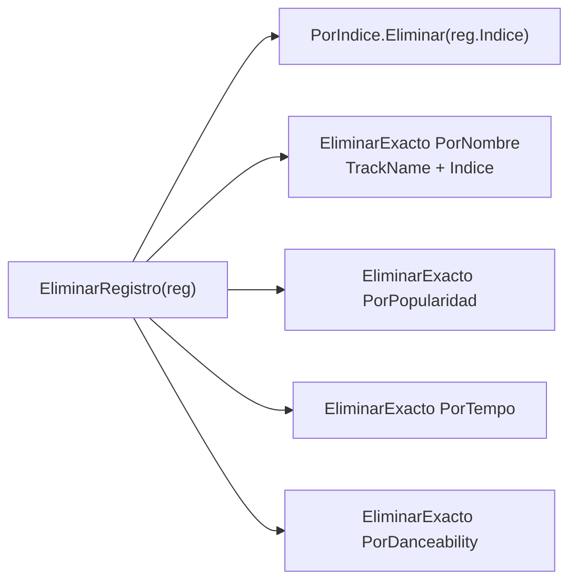
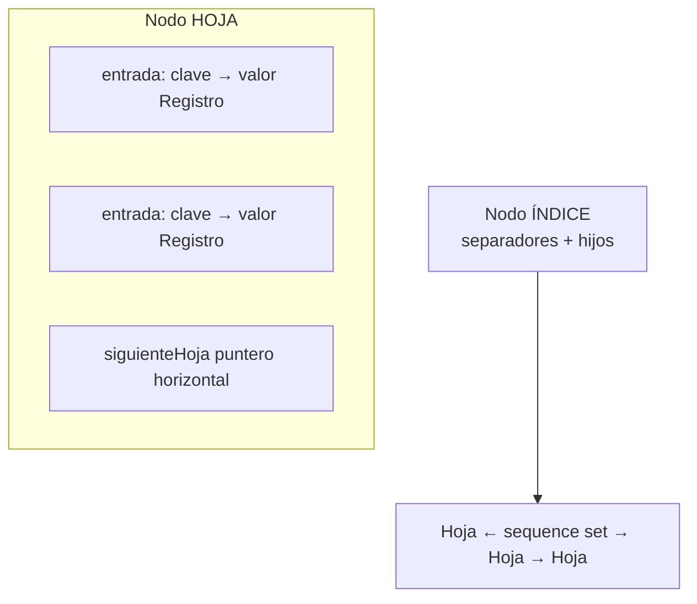

# Catálogo de 5 Índices (CatalogoIndices)

Modelo según Comer: índice primario único + secundarios con duplicados y sequence set.

## InsertarRegistro — cascada hacia 5 árboles

## EliminarRegistro — cascada con EliminarExacto

## Estructura de un árbol B+ (conceptual)

