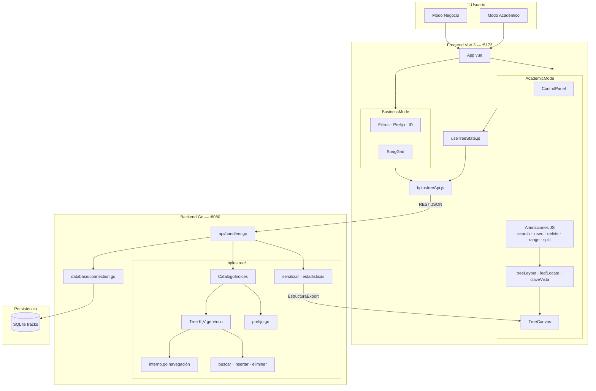
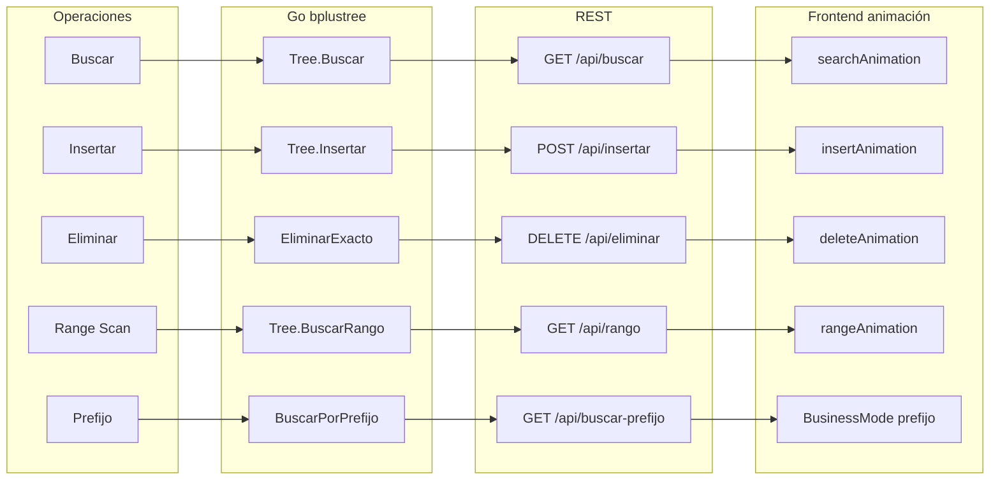
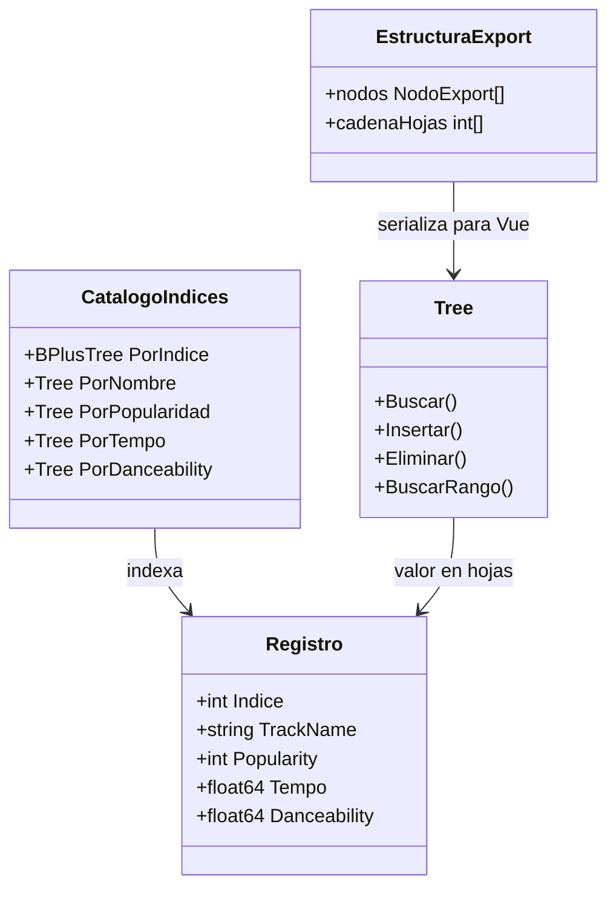

# Diagrama General — Interacción Completa

Vista unificada de cómo interactúan todas las capas del proyecto.

```mermaid
flowchart TB
    subgraph USUARIO["👤 Usuario"]
        UA["Modo Académico"]
        UN["Modo Negocio"]
    end

    subgraph FRONTEND["Frontend Vue 3 — :5173"]
        APP["App.vue"]
        subgraph ACADEMICO["AcademicMode"]
            CP["ControlPanel"]
            TC["TreeCanvas"]
            ANIM["Animaciones JS<br/>search · insert · delete · range · split"]
            TL["treeLayout · leafLocate · claveVista"]
        end
        subgraph NEGOCIO["BusinessMode"]
            FILT["Filtros · Prefijo · ID"]
            GRID["SongGrid"]
        end
        APIJS["bplustreeApi.js"]
        STATE["useTreeState.js"]
    end

    subgraph BACKEND["Backend Go — :8080"]
        HAND["api/handlers.go"]
        subgraph CORE["bplustree/"]
            CAT["CatalogoIndices"]
            TREE["Tree K,V genérico"]
            NAV["interno.go navegación"]
            OPS["buscar · insertar · eliminar"]
            PREF["prefijo.go"]
            SER["serializar · estadisticas"]
        end
        DBL["database/connection.go"]
    end

    subgraph DATA["Persistencia"]
        SQL[("SQLite tracks")]
    end

    UA --> APP --> ACADEMICO
    UN --> APP --> NEGOCIO
    ACADEMICO --> STATE --> APIJS
    NEGOCIO --> APIJS
    ANIM --> TL --> TC

    APIJS -->|REST JSON| HAND
    HAND --> CAT
    CAT --> TREE
    TREE --> NAV
    TREE --> OPS
    CAT --> PREF
    HAND --> SER
    HAND --> DBL --> SQL

    SER -->|EstructuraExport| TC
```

## Matriz operación × capa

```mermaid
flowchart LR
    subgraph Ops["Operaciones"]
        B["Buscar"]
        I["Insertar"]
        E["Eliminar"]
        R["Range Scan"]
        P["Prefijo"]
    end

    subgraph Go["Go bplustree"]
        TB["Tree.Buscar"]
        TI["Tree.Insertar"]
        TE["EliminarExacto"]
        TR["Tree.BuscarRango"]
        TP["BuscarPorPrefijo"]
    end

    subgraph API2["REST"]
        AB["GET /api/buscar"]
        AI["POST /api/insertar"]
        AE["DELETE /api/eliminar"]
        AR["GET /api/rango"]
        AP["GET /api/buscar-prefijo"]
    end

    subgraph FE2["Frontend animación"]
        SB["searchAnimation"]
        SI["insertAnimation"]
        SE["deleteAnimation"]
        SR["rangeAnimation"]
        SP["BusinessMode prefijo"]
    end

    B --> TB --> AB --> SB
    I --> TI --> AI --> SI
    E --> TE --> AE --> SE
    R --> TR --> AR --> SR
    P --> TP --> AP --> SP
```

## Tipos de datos clave

```mermaid
classDiagram
    class Registro {
        +int Indice
        +string TrackName
        +int Popularity
        +float64 Tempo
        +float64 Danceability
    }
    class CatalogoIndices {
        +BPlusTree PorIndice
        +Tree PorNombre
        +Tree PorPopularidad
        +Tree PorTempo
        +Tree PorDanceability
    }
    class Tree {
        +Buscar()
        +Insertar()
        +Eliminar()
        +BuscarRango()
    }
    class EstructuraExport {
        +nodos NodoExport[]
        +cadenaHojas int[]
    }

    CatalogoIndices --> Registro : indexa
    Tree --> Registro : valor en hojas
    EstructuraExport --> Tree : serializa para Vue
```
