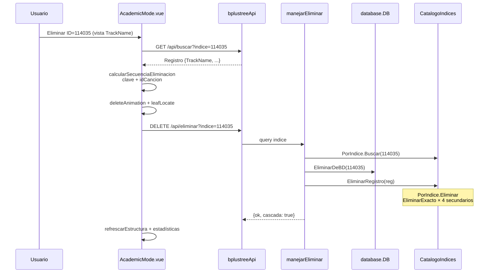
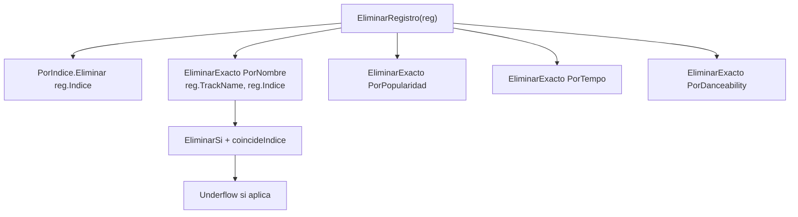
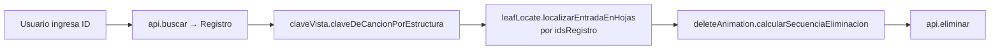
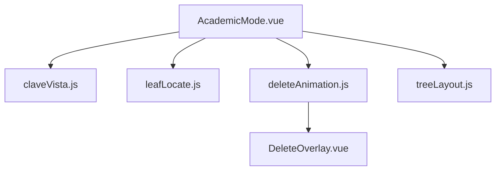

# Interacción: Flujo Eliminar en Cascada

Eliminar por ID en índice primario → cascada en 4 secundarios con `EliminarExacto`.

## EliminarRegistro detalle

## Animación en vista secundaria

## Frontend utils involucrados

