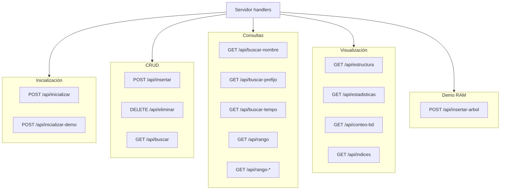
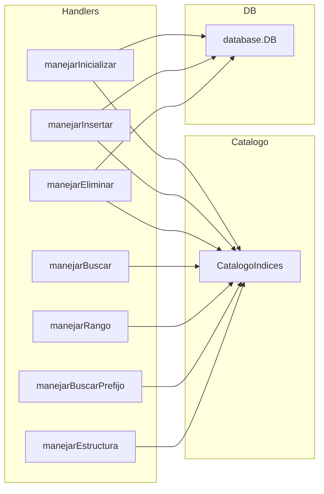
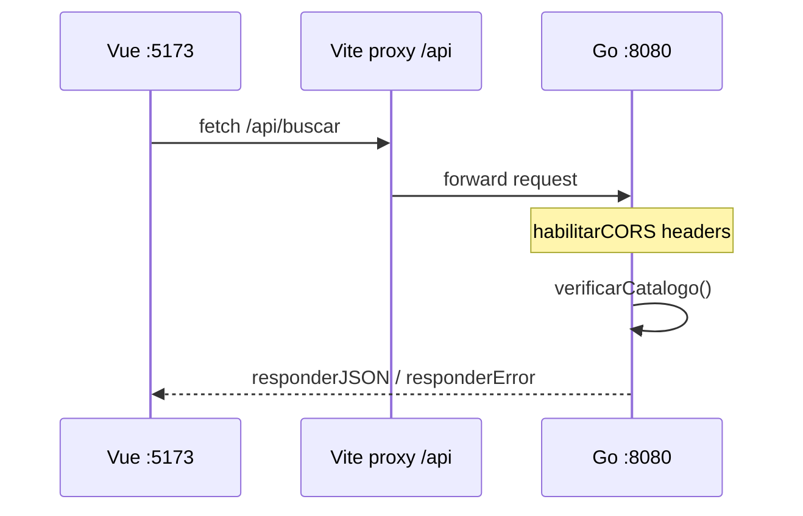

# Interacción: Flujo General API REST

Archivo: `api/handlers.go`

## Mapa de endpoints

```mermaid
flowchart TB
    subgraph INIT["Inicialización"]
        I1["POST /api/inicializar"]
        I2["POST /api/inicializar-demo"]
    end

    subgraph CRUD["CRUD"]
        C1["POST /api/insertar"]
        C2["DELETE /api/eliminar"]
        C3["GET /api/buscar"]
    end

    subgraph QUERY["Consultas"]
        Q1["GET /api/buscar-nombre"]
        Q2["GET /api/buscar-prefijo"]
        Q3["GET /api/buscar-tempo"]
        Q4["GET /api/rango"]
        Q5["GET /api/rango-*"]
    end

    subgraph VIZ["Visualización"]
        V1["GET /api/estructura"]
        V2["GET /api/estadisticas"]
        V3["GET /api/conteo-bd"]
        V4["GET /api/indices"]
    end

    subgraph DEMO["Demo RAM"]
        D1["POST /api/insertar-arbol"]
    end

    H["Servidor handlers"] --> INIT & CRUD & QUERY & VIZ & DEMO
```

## Handlers → bplustree

```mermaid
flowchart LR
    subgraph Handlers
        MI["manejarInicializar"]
        MB["manejarBuscar"]
        MINS["manejarInsertar"]
        ME["manejarEliminar"]
        MR["manejarRango"]
        MP["manejarBuscarPrefijo"]
        MEST["manejarEstructura"]
    end

    subgraph Catalogo
        CAT["CatalogoIndices"]
    end

    subgraph DB
        SQL["database.DB"]
    end

    MI --> SQL
    MI --> CAT
    MINS --> SQL
    MINS --> CAT
    ME --> SQL
    ME --> CAT
    MB & MR & MP & MEST --> CAT
```

## CORS y respuestas

```mermaid
sequenceDiagram
    participant V as Vue :5173
    participant P as Vite proxy /api
    participant G as Go :8080

    V->>P: fetch /api/buscar
    P->>G: forward request
    Note over G: habilitarCORS headers
    G->>G: verificarCatalogo()
    G-->>V: responderJSON / responderError
```
