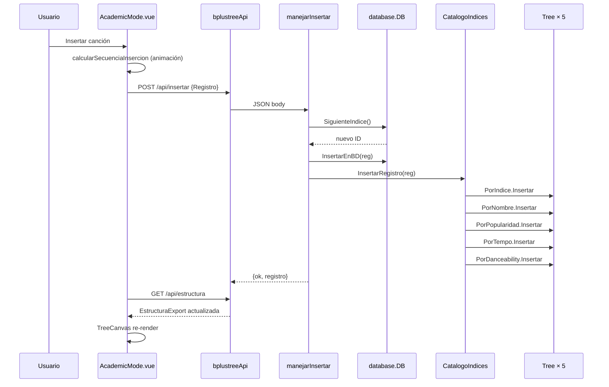
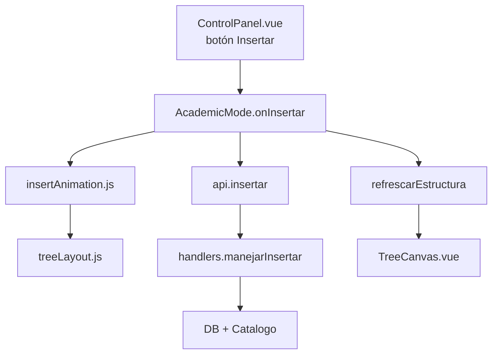
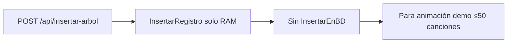

# Interacción: Flujo Insertar Completo

End-to-end desde Vue hasta 5 árboles + SQLite.

```mermaid
sequenceDiagram
    participant U as Usuario
    participant A as AcademicMode.vue
    participant API as bplustreeApi
    participant H as manejarInsertar
    participant D as database.DB
    participant C as CatalogoIndices
    participant T as Tree × 5

    U->>A: Insertar canción
    A->>A: calcularSecuenciaInsercion (animación)
    A->>API: POST /api/insertar {Registro}
    API->>H: JSON body
    H->>D: SiguienteIndice()
    D-->>H: nuevo ID
    H->>D: InsertarEnBD(reg)
    H->>C: InsertarRegistro(reg)
    C->>T: PorIndice.Insertar
    C->>T: PorNombre.Insertar
    C->>T: PorPopularidad.Insertar
    C->>T: PorTempo.Insertar
    C->>T: PorDanceability.Insertar
    H-->>API: {ok, registro}
    A->>API: GET /api/estructura
    API-->>A: EstructuraExport actualizada
    A->>A: TreeCanvas re-render
```

## Diagrama de componentes

```mermaid
flowchart TB
    CP["ControlPanel.vue<br/>botón Insertar"] --> AM["AcademicMode.onInsertar"]
    AM --> INS["insertAnimation.js"]
    INS --> TL["treeLayout.js"]
    AM --> API["api.insertar"]
    API --> H["handlers.manejarInsertar"]
    H --> D["DB + Catalogo"]
    AM --> REF["refrescarEstructura"]
    REF --> TC["TreeCanvas.vue"]
```

## Demo sin SQLite (insertar-arbol)

```mermaid
flowchart LR
    A["POST /api/insertar-arbol"] --> B["InsertarRegistro solo RAM"]
    B --> C["Sin InsertarEnBD"]
    C --> D["Para animación demo ≤50 canciones"]
```
