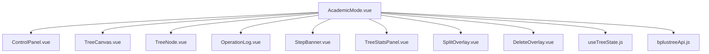
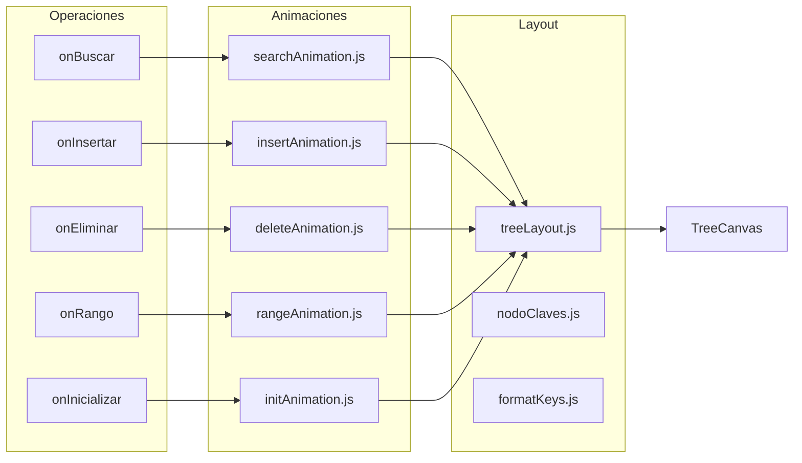
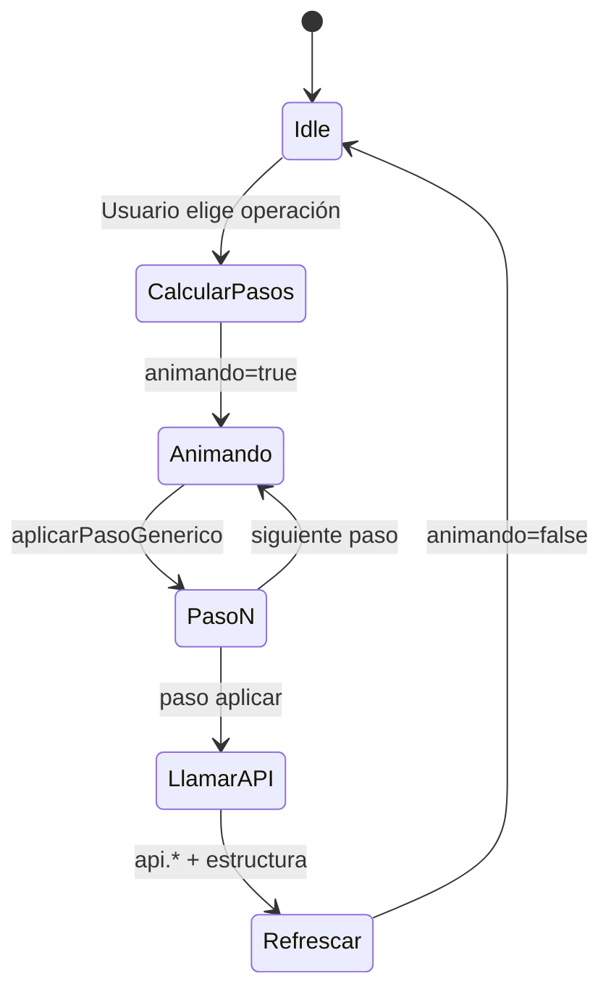
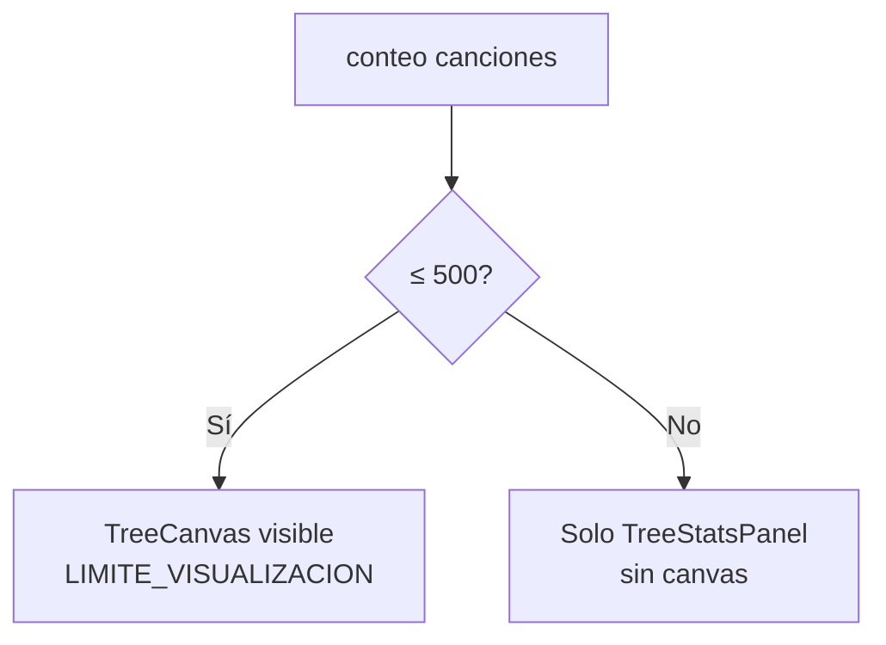
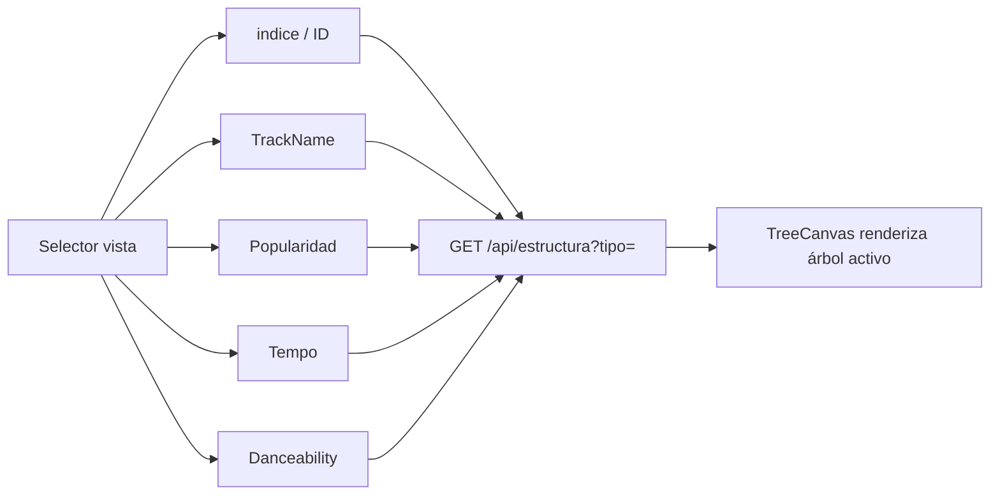

# Interacción: Modo Académico y Animaciones

Vista: `AcademicMode.vue` — canvas B+ con operaciones paso a paso.

## Componentes principales

## Mapa operación → animación

## Ciclo de una operación animada

## Límite de visualización

## Vistas de árbol intercambiables

