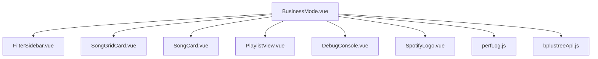
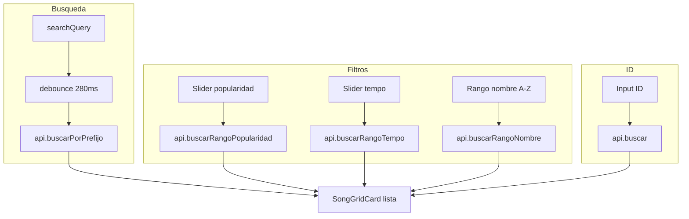
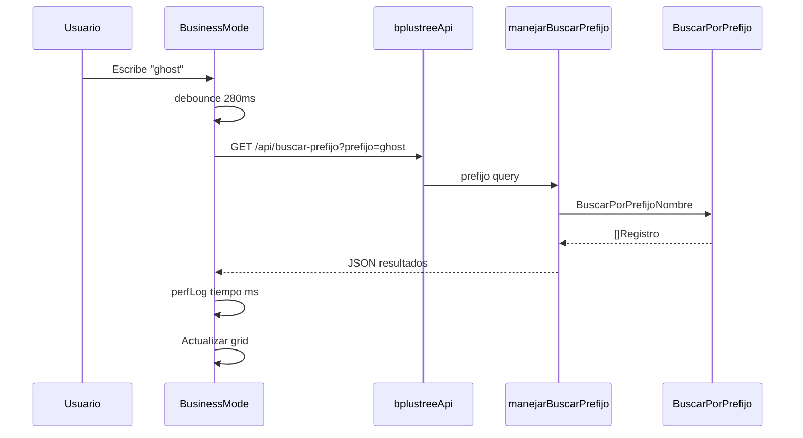
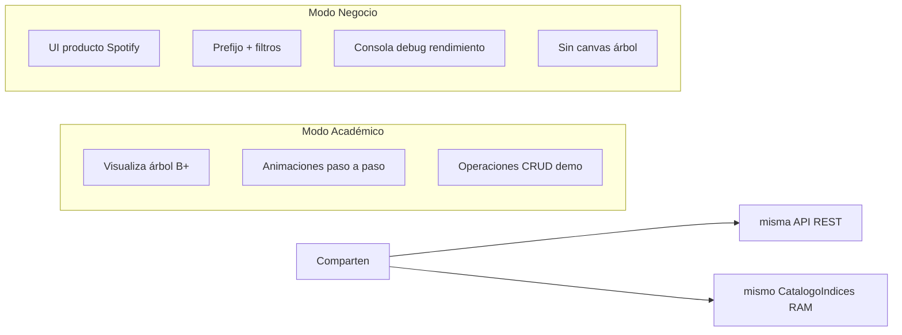

# Interacción: Modo Negocio — Consultas

Vista: `BusinessMode.vue` — UI estilo Spotify sin canvas de árbol.

## Componentes

## Flujos de consulta

## Secuencia autocompletado por prefijo

## Comparación Modo Académico vs Negocio

