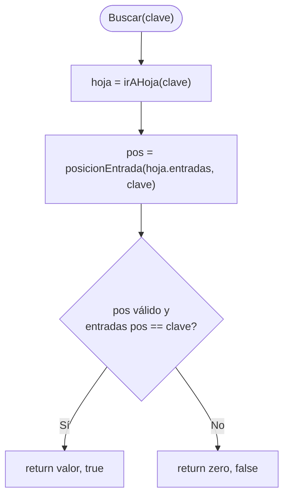
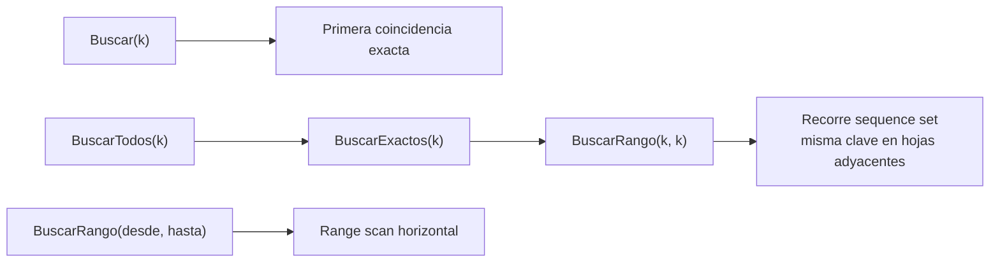
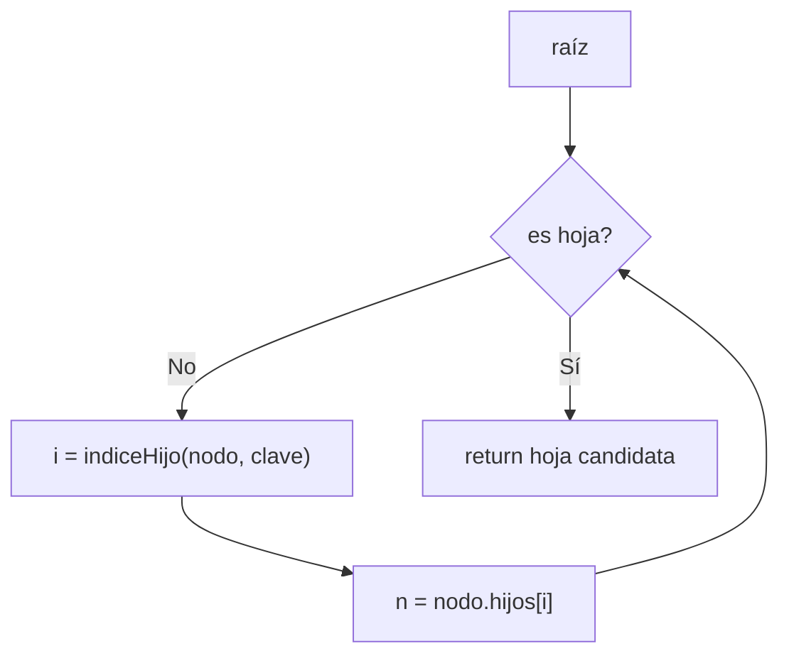
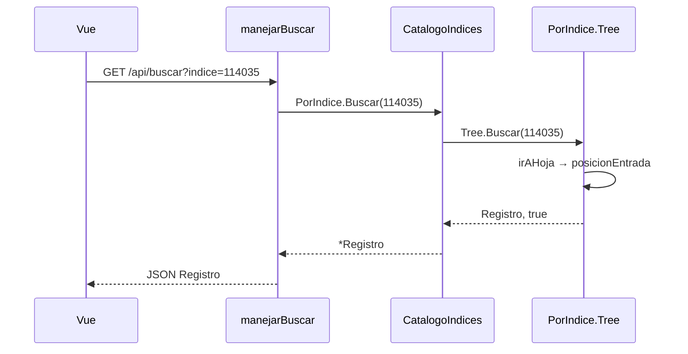

# Operación: Buscar

**API:** `Tree[K,V].Buscar(clave)` — O(log d n)

```mermaid
flowchart TD
    START(["Buscar(clave)"]) --> A["hoja = irAHoja(clave)"]
    A --> B["pos = posicionEntrada(hoja.entradas, clave)"]
    B --> C{pos válido y<br/>entradas pos == clave?}
    C -->|Sí| OK["return valor, true"]
    C -->|No| FAIL["return zero, false"]
```

## Variantes públicas

```mermaid
flowchart LR
    B["Buscar(k)"] --> H["Primera coincidencia exacta"]
    BA["BuscarTodos(k)"] --> BE["BuscarExactos(k)"]
    BE --> BR["BuscarRango(k, k)"]
    BR --> SS["Recorre sequence set<br/>misma clave en hojas adyacentes"]
    BR2["BuscarRango(desde, hasta)"] --> SS2["Range scan horizontal"]
```

## Navegación interna durante búsqueda

```mermaid
flowchart TD
    R["raíz"] --> IH{es hoja?}
    IH -->|No| IDX["i = indiceHijo(nodo, clave)"]
    IDX --> DESC["n = nodo.hijos[i]"]
    DESC --> IH
    IH -->|Sí| LEAF["return hoja candidata"]
```

## Secuencia API REST — buscar por ID

```mermaid
sequenceDiagram
    participant V as Vue
    participant A as manejarBuscar
    participant C as CatalogoIndices
    participant T as PorIndice.Tree

    V->>A: GET /api/buscar?indice=114035
    A->>C: PorIndice.Buscar(114035)
    C->>T: Tree.Buscar(114035)
    T->>T: irAHoja → posicionEntrada
    T-->>C: Registro, true
    C-->>A: *Registro
    A-->>V: JSON Registro
```
