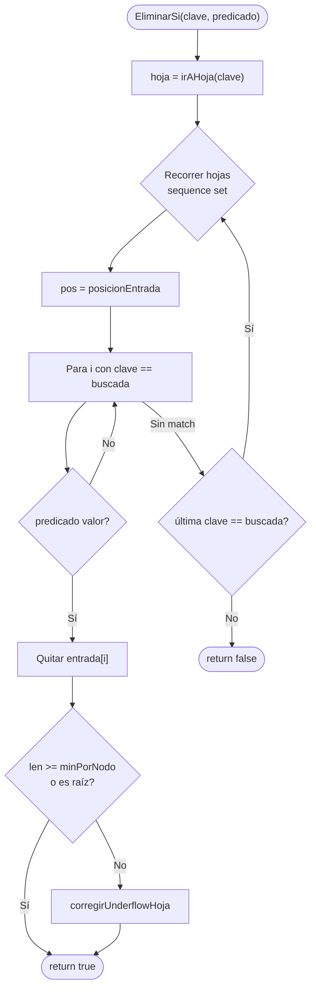
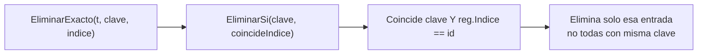
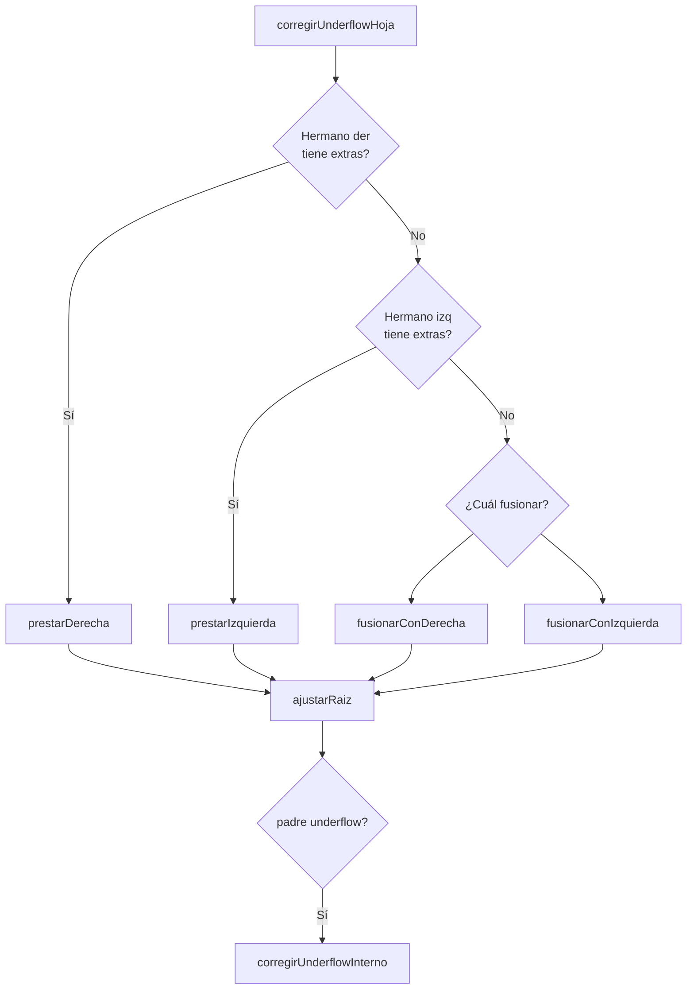
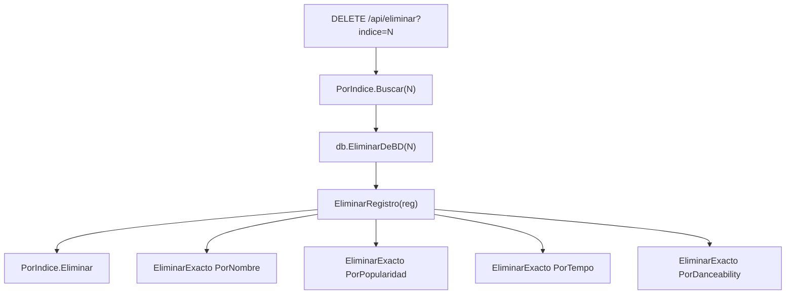

# Operación: Eliminar

**API:** `Tree.Eliminar(clave)` / `EliminarExacto(t, clave, id)` — O(log d n)

## EliminarExacto en índices secundarios

## Underflow en hoja — decisión

## Cascada EliminarRegistro

