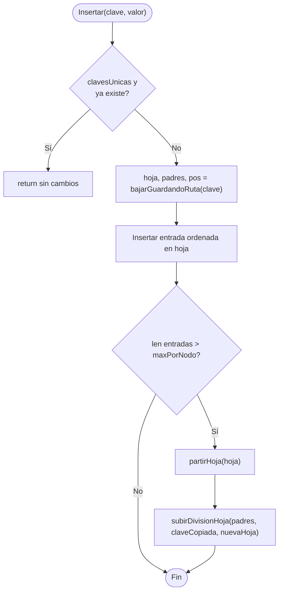
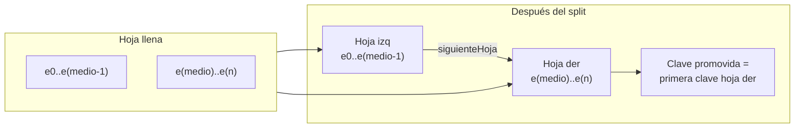
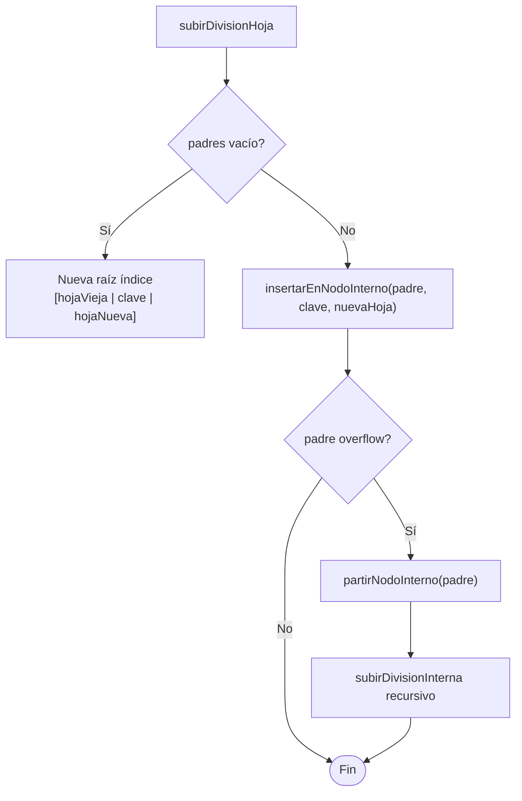
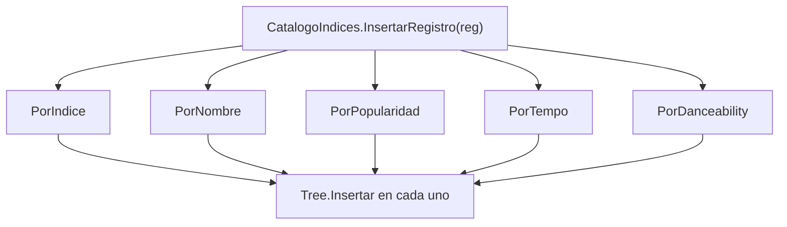

# Operación: Insertar

**API:** `Tree[K,V].Insertar(clave, valor)` — O(log d n)

```mermaid
flowchart TD
    START(["Insertar(clave, valor)"]) --> UQ{clavesUnicas y<br/>ya existe?}
    UQ -->|Sí| RET["return sin cambios"]
    UQ -->|No| ROUTE["hoja, padres, pos = bajarGuardandoRuta(clave)"]
    ROUTE --> INS["Insertar entrada ordenada en hoja"]
    INS --> OF{len entradas > maxPorNodo?}
    OF -->|No| DONE(["Fin"])
    OF -->|Sí| SPLIT["partirHoja(hoja)"]
    SPLIT --> UP["subirDivisionHoja(padres, claveCopiada, nuevaHoja)"]
    UP --> DONE
```

## Split de hoja (partirHoja)

```mermaid
flowchart LR
    subgraph ANTES["Hoja llena"]
        E1["e0..e(medio-1)"]
        E2["e(medio)..e(n)"]
    end

    subgraph DESPUES["Después del split"]
        IZQ["Hoja izq<br/>e0..e(medio-1)"]
        DER["Hoja der<br/>e(medio)..e(n)"]
        PROM["Clave promovida =<br/>primera clave hoja der"]
    end

    ANTES --> IZQ
    ANTES --> DER
    DER --> PROM
    IZQ -->|siguienteHoja| DER
```

## Subida al padre (subirDivisionHoja)

```mermaid
flowchart TD
    A["subirDivisionHoja"] --> B{padres vacío?}
    B -->|Sí| NR["Nueva raíz índice<br/>[hojaVieja | clave | hojaNueva]"]
    B -->|No| C["insertarEnNodoInterno(padre, clave, nuevaHoja)"]
    C --> D{padre overflow?}
    D -->|No| END(["Fin"])
    D -->|Sí| E["partirNodoInterno(padre)"]
    E --> F["subirDivisionInterna recursivo"]
    F --> END
```

## InsertarRegistro — 5 árboles

```mermaid
flowchart TB
    IR["CatalogoIndices.InsertarRegistro(reg)"] --> I1["PorIndice"]
    IR --> I2["PorNombre"]
    IR --> I3["PorPopularidad"]
    IR --> I4["PorTempo"]
    IR --> I5["PorDanceability"]
    I1 & I2 & I3 & I4 & I5 --> T["Tree.Insertar en cada uno"]
```
