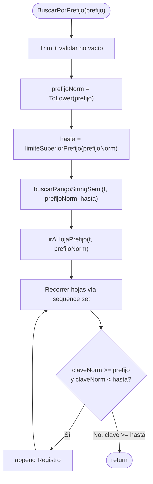
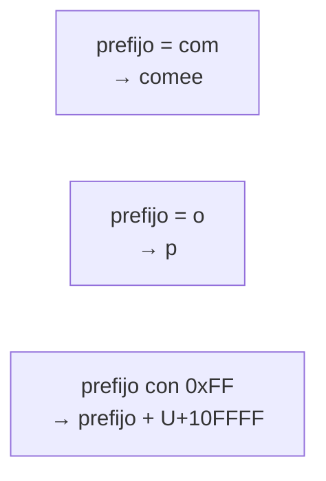
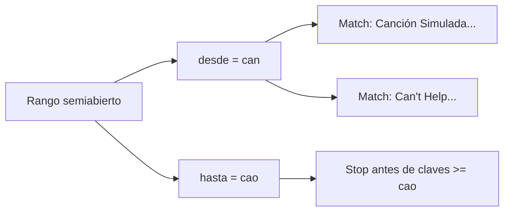
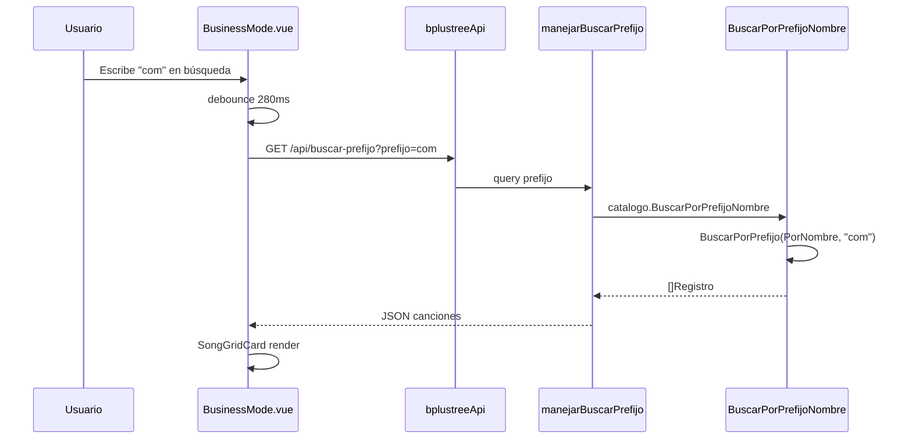

# Operación: Búsqueda por Prefijo

**API:** `BuscarPorPrefijo(t, prefijo)` — O(log d n + k)

Implementación como range scan semiabierto sobre `PorNombre`.

## limiteSuperiorPrefijo

## Ejemplo: prefijo "Can"

## Flujo API + Modo Negocio

