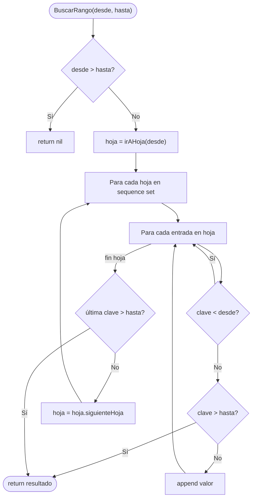
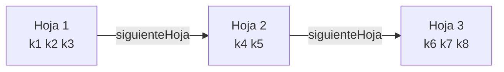
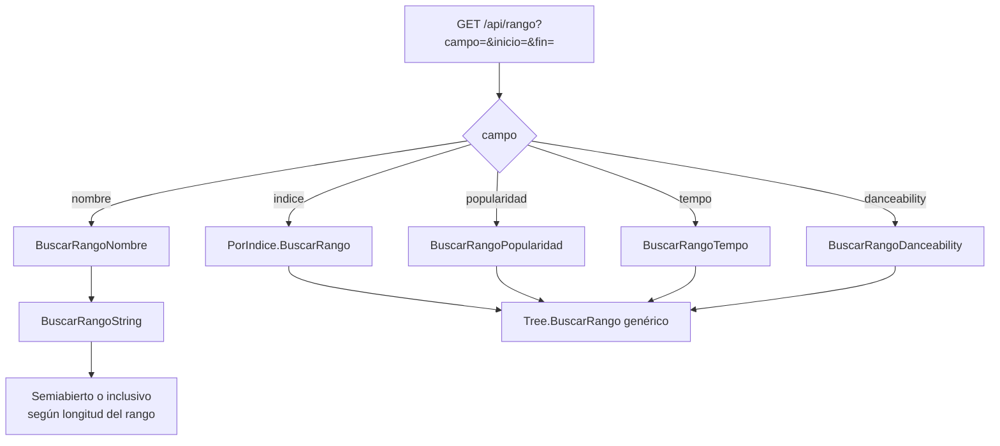
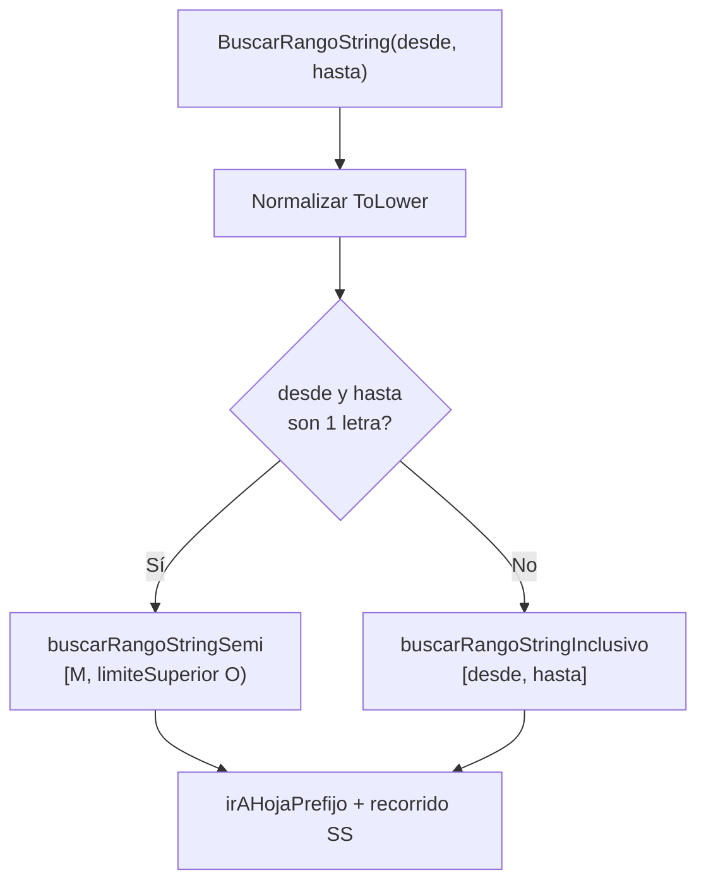

# Operación: Range Scan (BuscarRango)

**API:** `Tree[K,V].BuscarRango(desde, hasta)` — O(log d n + k)

## Sequence set (enlace horizontal entre hojas)

## Range scan por tipo de índice

## BuscarRangoString — lógica de strings

