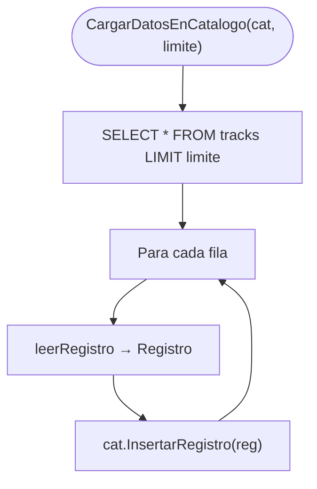
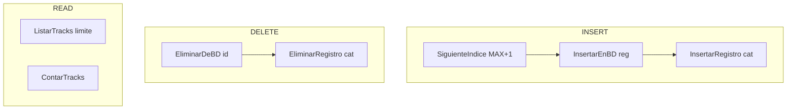
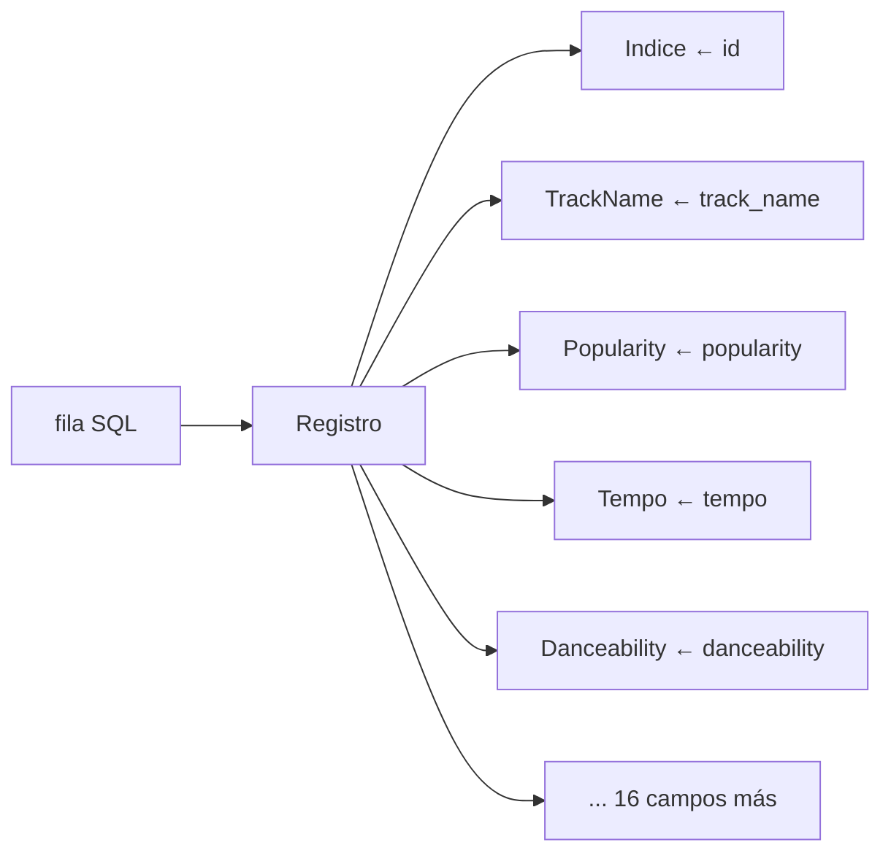
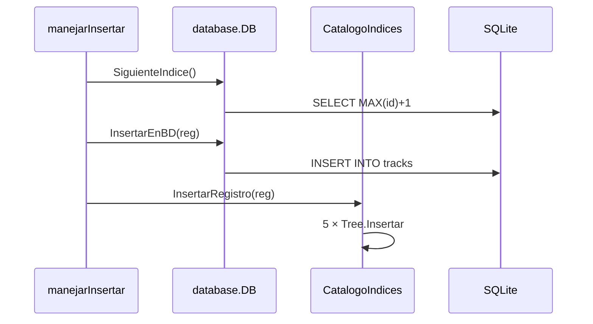

# Subfunciones: Base de Datos SQLite

Archivo: `database/connection.go`

## Conexión y tabla

## CargarDatosEnCatalogo

## Operaciones CRUD en BD

## leerRegistro — mapeo SQL → Go

## Secuencia insertar persistente

