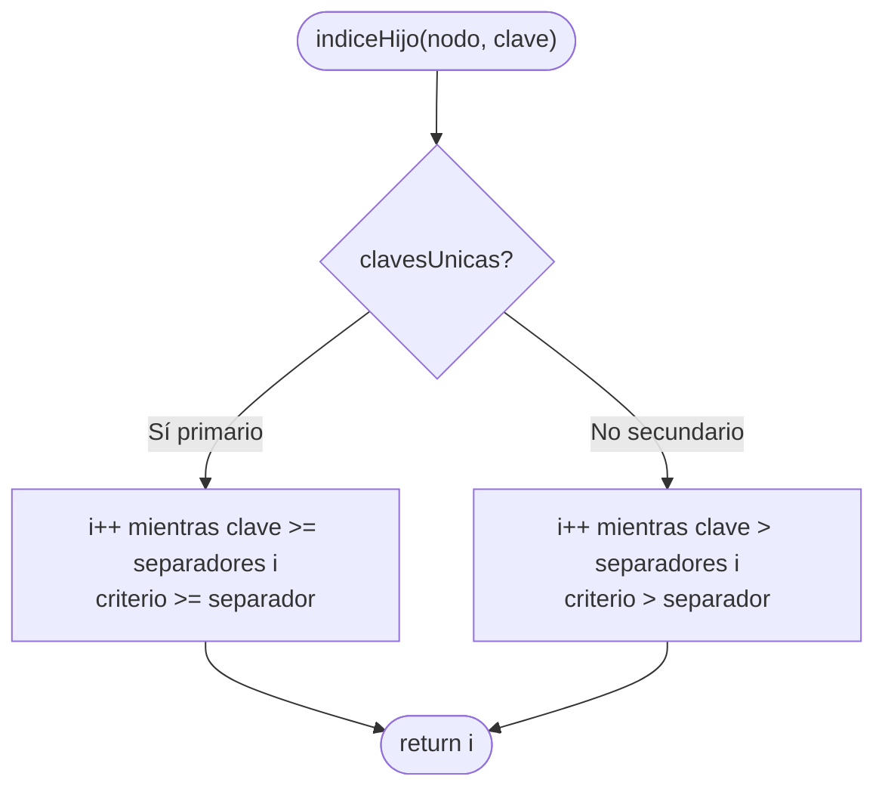
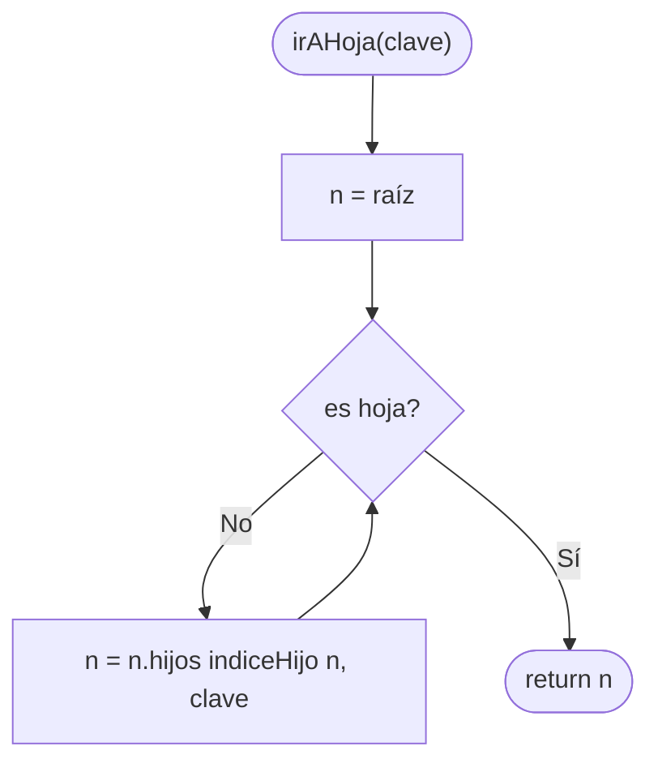
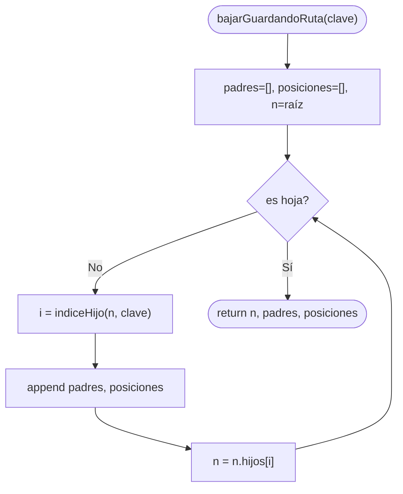
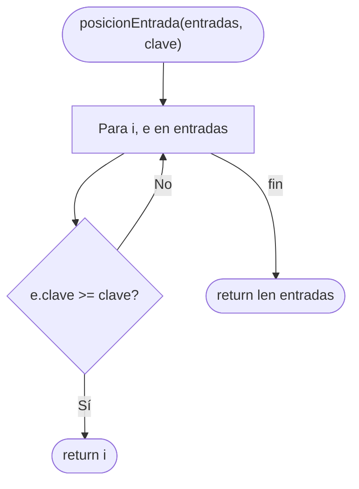
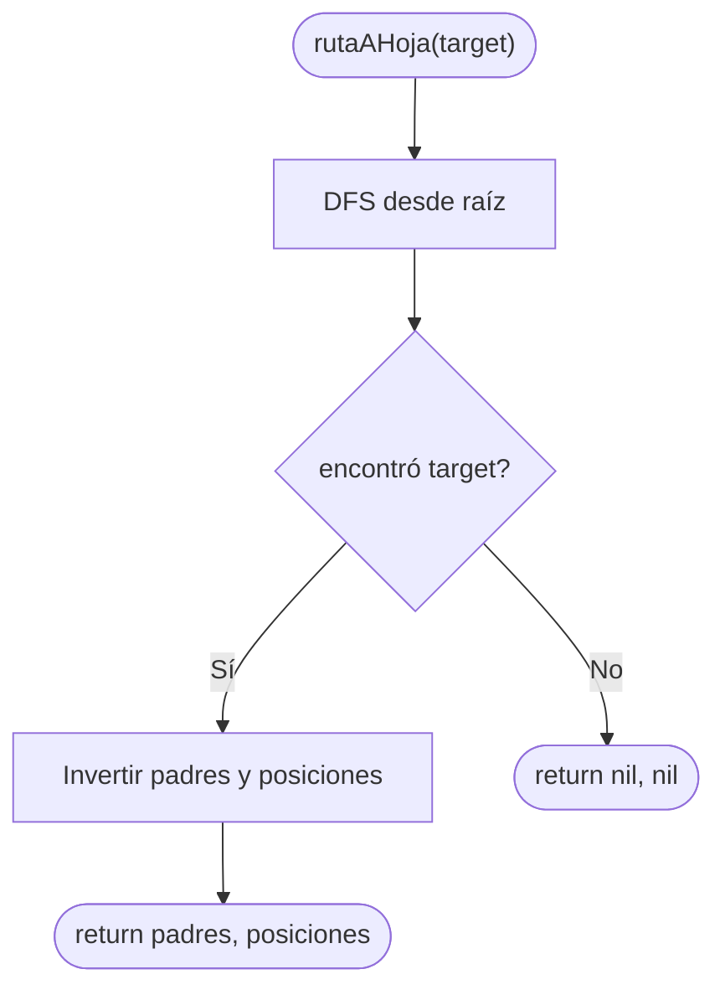
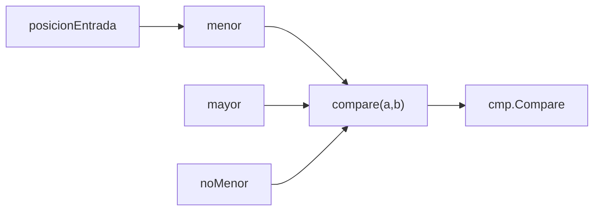

# Subfunciones: Navegación Interna

Archivo: `bplustree/interno.go` — usado por buscar, insertar y eliminar.

## indiceHijo — elegir puntero en nodo índice

## irAHoja — bajar hasta hoja candidata

## bajarGuardandoRuta — para insertar con split

## posicionEntrada — búsqueda binaria lineal en hoja

## rutaAHoja — reconstruir padres tras eliminar

## Helpers de comparación

