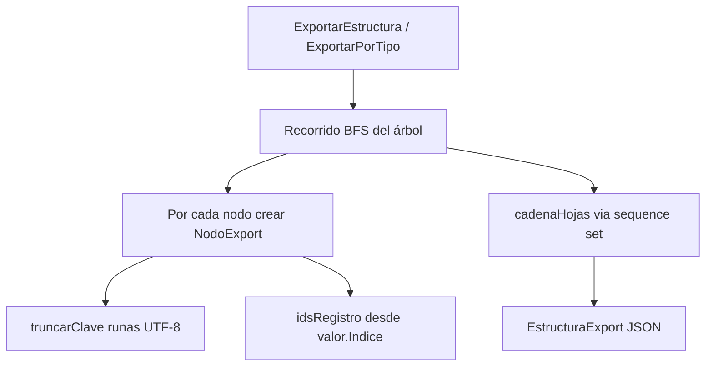
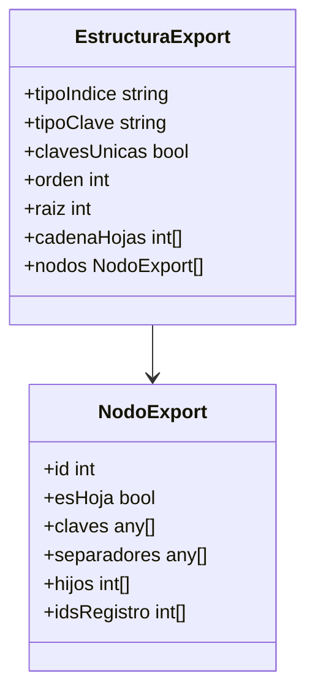
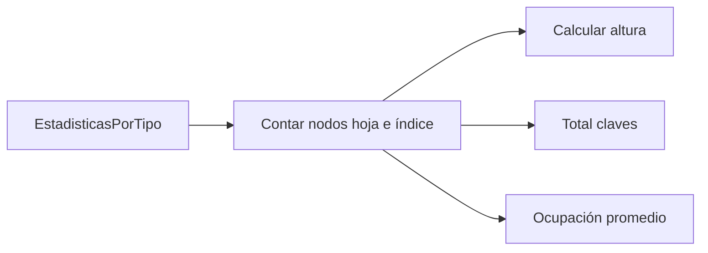
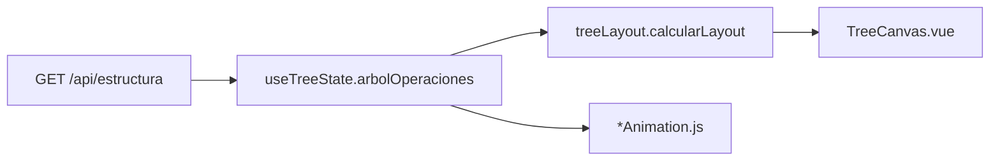

# Subfunciones: Serialización y Estadísticas

Archivos: `bplustree/serializar.go`, `bplustree/estadisticas.go`

## ExportarEstructura — JSON para canvas

## Campos EstructuraExport

## EstadisticasArbol

## Frontend consume estructura

