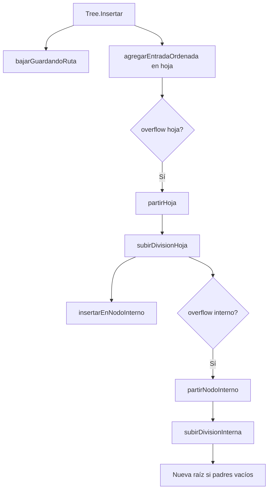
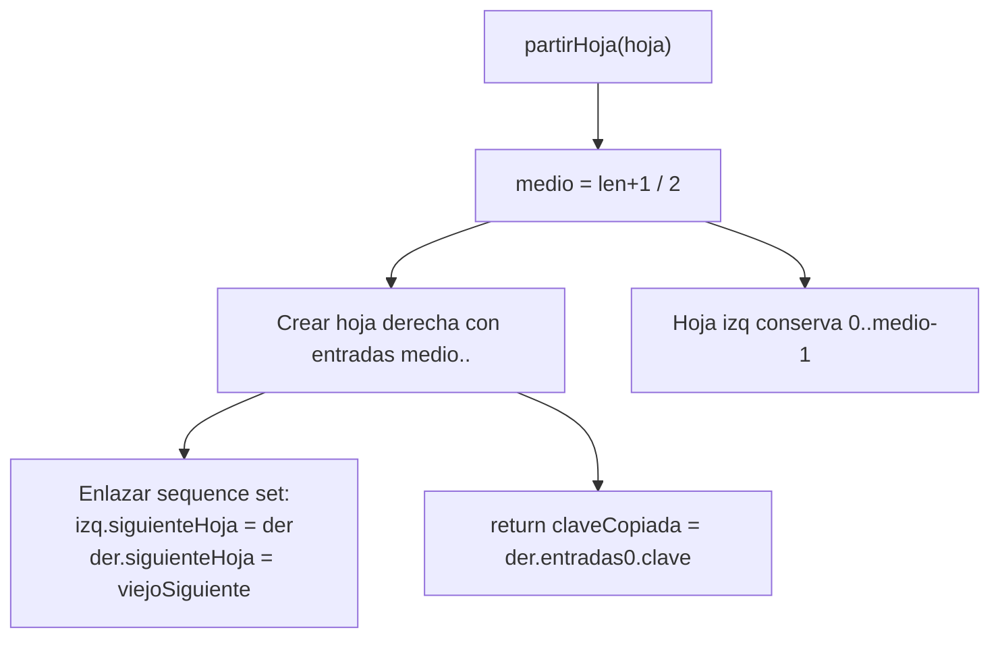
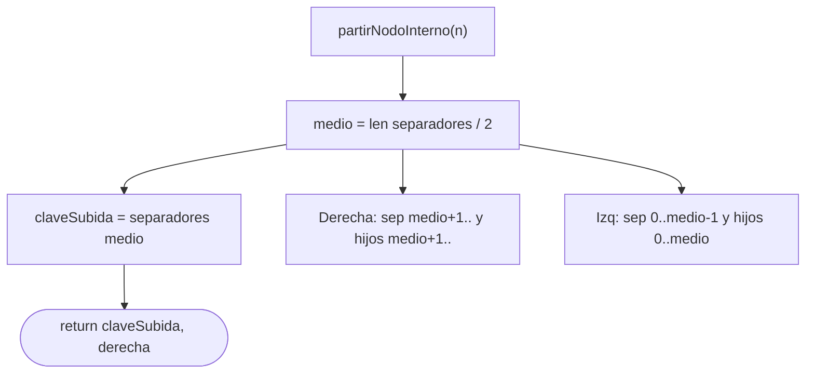
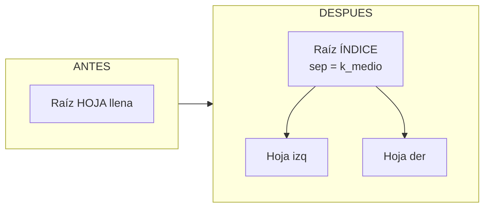
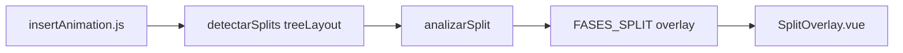

# Subfunciones: Split y Overflow

Archivo: `bplustree/insertar.go`

## Árbol de llamadas al insertar con overflow

## partirHoja — detalle

## partirNodoInterno — detalle

## Caso: raíz se convierte en índice

## Animación frontend (splitAnimation.js)

