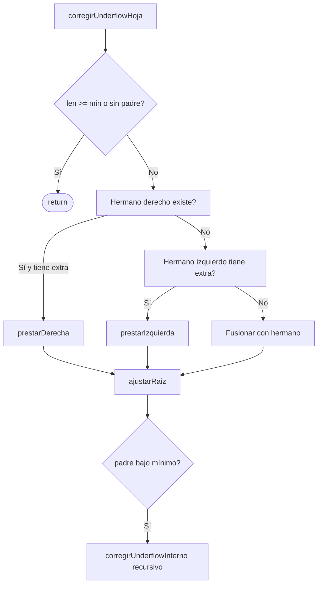
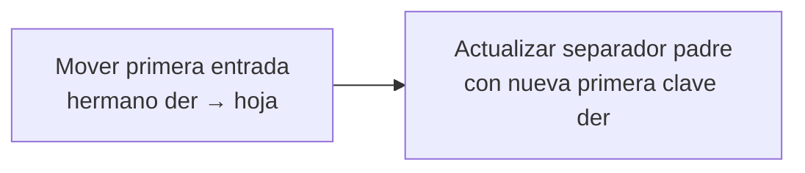
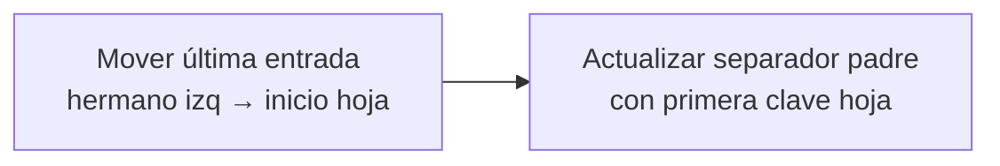
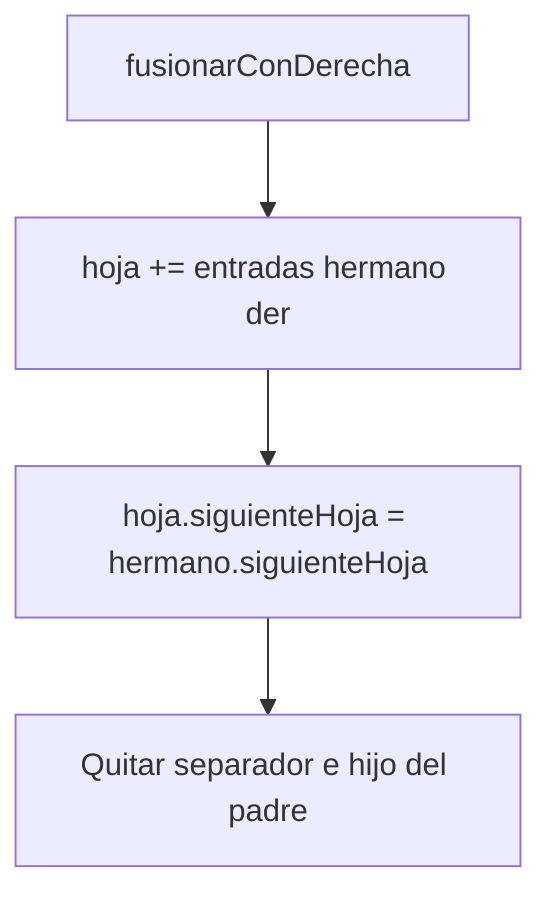
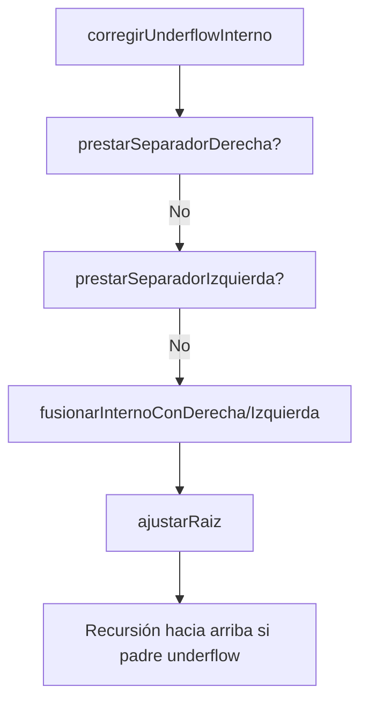
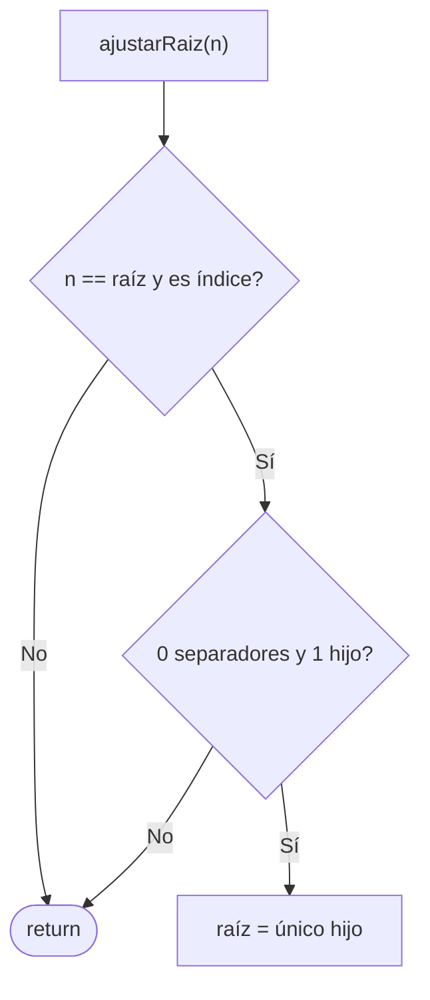
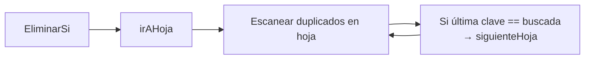

# Subfunciones: Underflow — Préstamo y Fusión

Archivo: `bplustree/eliminar.go`

## corregirUnderflowHoja

## prestarDerecha

## prestarIzquierda

## fusionarConDerecha

## corregirUnderflowInterno

## ajustarRaiz — colapsar raíz vacía

## EliminarSi + sequence set

